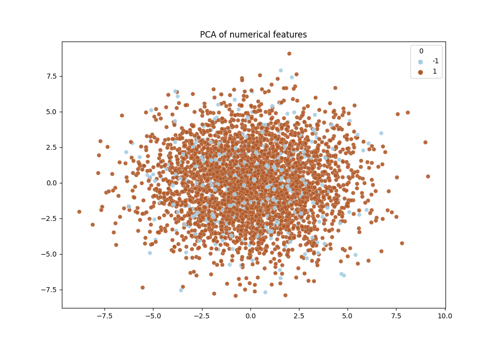

## EDA
First we had to look into our data. We did some basic statistic.
There was no missing values nor duplicates. We used Z-score to determinate outliners. Z-score is just the number of standard deviations away from the mean that a certain data point is. The method removed about 2800 columns with
outliners. 

Next we checked out the correlation coefficients between variables using correlation matrix. There were no the columns with correlation greater than 0.8.

Time for PCA. First we scaled the features using StandardScaler to make the optimal performance of machine learning algorithms. Then we visualized it.

T-SNE. This stochastic method is used primarily for the exploration and visualization 
of multidimensional data.

Moving on to splitting our data to train and test. We used train_test_split with test size of 0.3. 

Implementing classifications, we did 4:
+ DummyClassifier
+ SVC
+ LogisticRegression
+ KNClassifier
+ Random Forest Classifier

Model #1 Dummy Classifier
The first model classification we generate is a dummy classifier. We compare our models' success to each other but also to this baseline model.

We clearly have a class imbalance problem. We try with SMOTE the training data and see if training a model with this method would improve our results.

BestModel #2 
The best hyperparameters are for SVC:

Out of the four models, the SVC model is the best one in predicting classes for labels. 
