## EDA
First we had to look into our data. We did some basic statistic.
There was no missing values nor duplicates. We used Z-score to determinate outliners. Z-score is just the number of standard deviations away from the mean that a certain data point is. The method removed about 2800 columns with
outliners. 

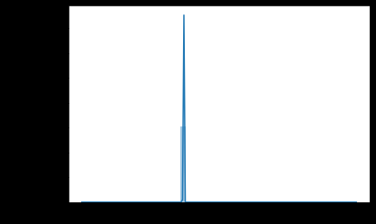

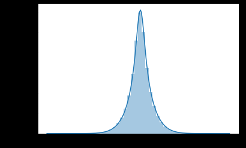

Next we checked out the correlation coefficients between variables using correlation
matrix. We threw out the columns with correlation greater than 0.8.

Time for PCA. First we scaled the features using StandardScaler to make the optimal
performance of machine learning algorithms. Then we visualized it by plotting 2 
dimensional data. The reduced 2-dimensional data still contains 0.2% of the variance 
of the original data.

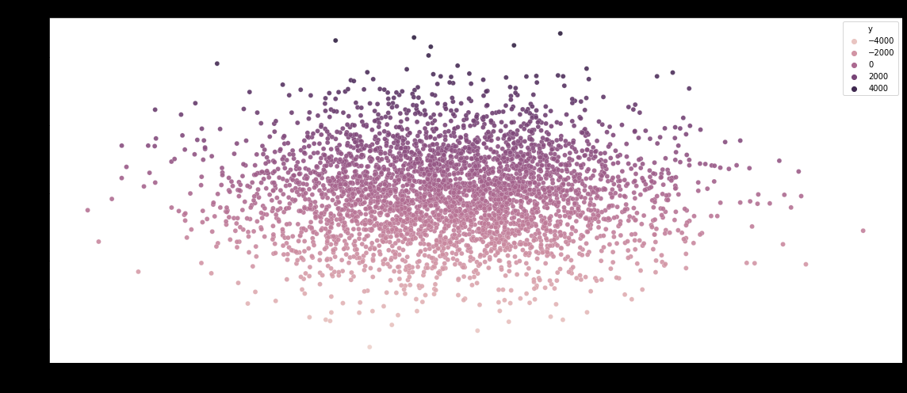

T-SNE. This stochastic method is used primarily for the exploration and visualization 
of multidimensional data.

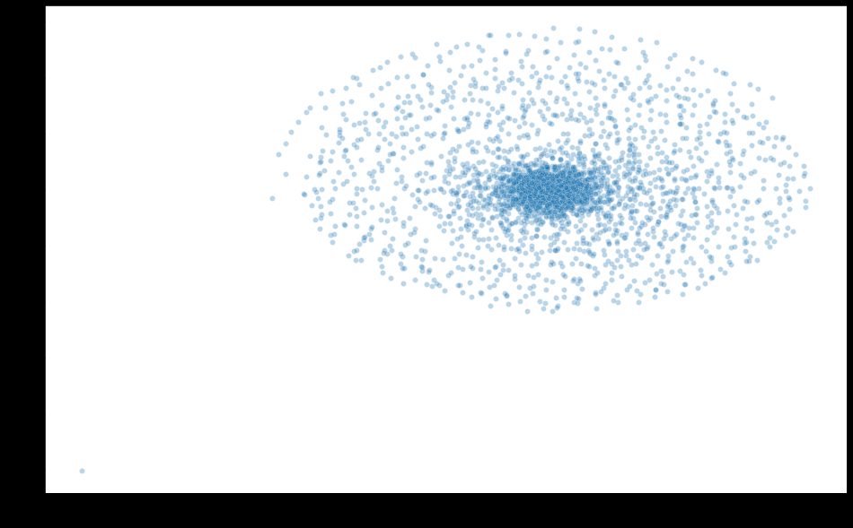

We saved our data using joblib for further analyze.

Moving on to splitting our data to train and test. We used train_test_split with test 
size of 0.2. 

Implementing classifications, we did 4:
+ DummyClassifier
+ LogisticRegression
+ KNClassifier
+ Random Forest Classifier

Model #1 Dummy Classifier
The first model classification we generate is a dummy classifier. We compare our models' success to each other but also to this baseline model.

Our dummy classifier correctly predicted 89%. And we clearly have a class imbalance problem. We try with SMOTE the training data and see if training a model with this method would improve our results.

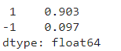

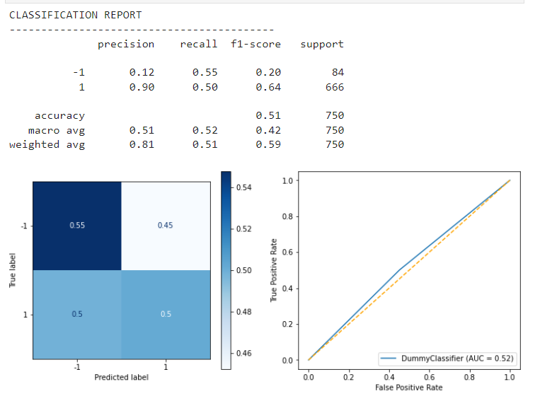

Model #2 Random Forest Classifier

For its model we can use also SMOTE too see if results will be better.

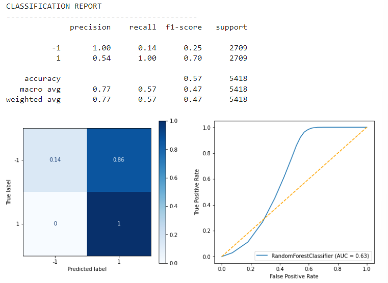

Our model is performing too perfectly since it is overfitting to the training set. We try to use a grid search to optimize for the f1 score.

Hyperparameter Tuning

The best estimator for its model we got as there.

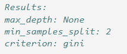

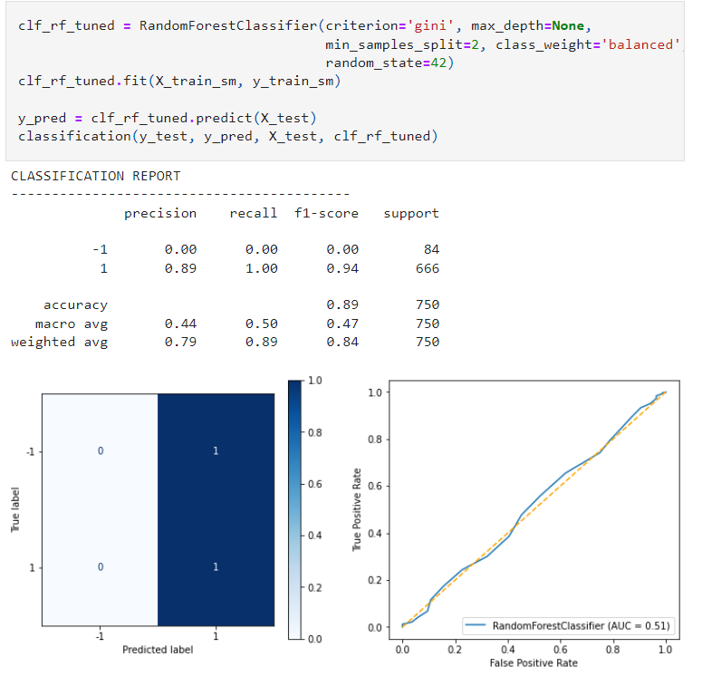

Model #3 LogisticRegression

SMOTE

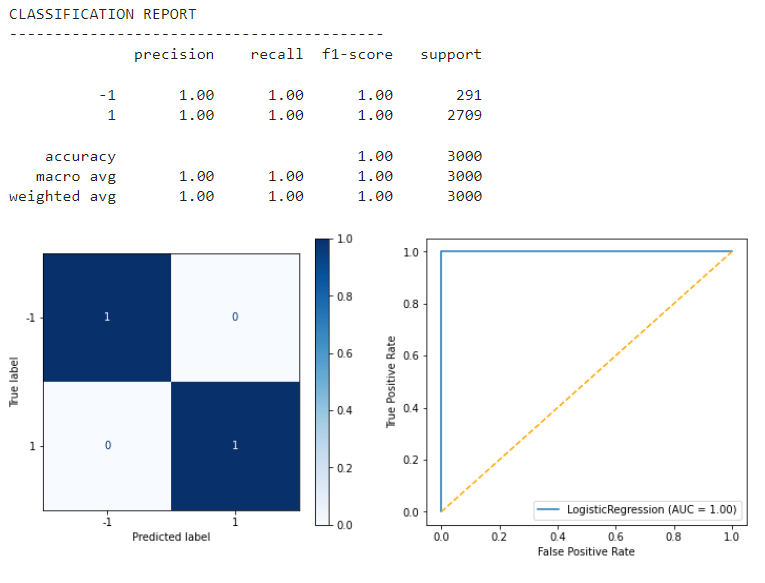

Hyperparameter Tuning

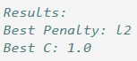

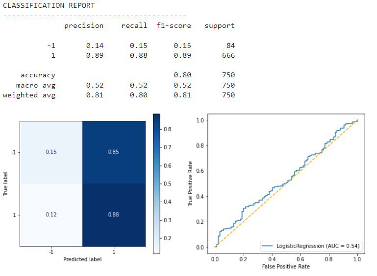

Model #4 KNClassifier

For that model we will be using a different value for K. While the camparison we will see which K gives the best results.

for n_neighbors=1

for n_neighbors=3

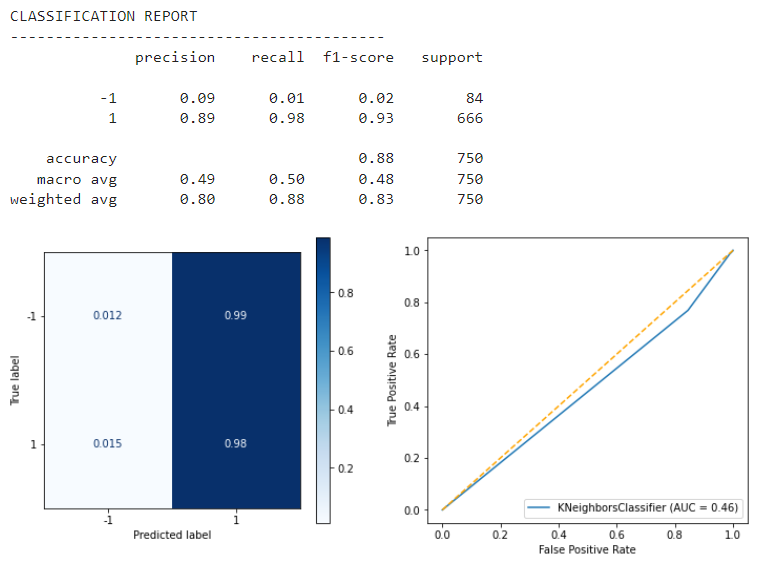

for n_neighbors=5

Analyzing scores we can see that for n_neighbors=5 is the best option.

RESULTS

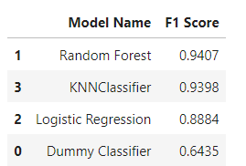

Out of the three models, the Random Forest model is the best one in predicting classes for labels. 
